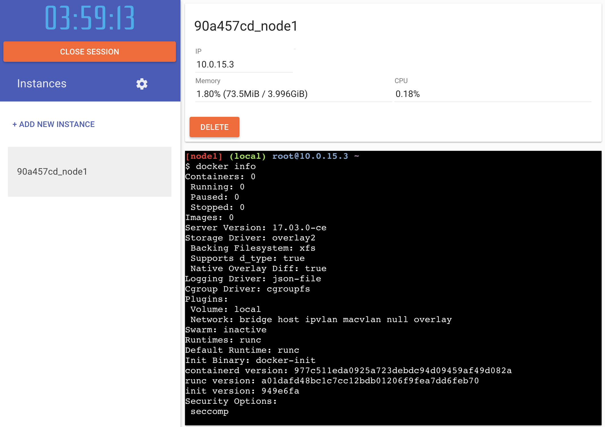

# Docker Swarming Demo

login to and create instances

* https://play-with-docker.com




## create swarm

```
$ ip addr show eth0
$ docker swarm init --advertise-addr 10.0.15.3
$ docker swarm join-token worker
$ docker swarm join \
    --token SWMTKN-1-2pjq70gobb27r5f8en40msep6tiy83ej3rpl2eskgr0nvloupp-d3kewm9zh2q5flijunizkwuvq \
    10.0.15.3:2377
```

## check the example

```
$ docker run -d -P --name iamfoo emilevauge/whoami
$ docker inspect --format '{{ .NetworkSettings.Ports }}' iamfoo
$ curl -s http://play-with-docker.com/p/<node>:<port>
```

## start local registry

```
$ docker service create --name registry \
   --constraint 'node.role == manager' \
   --publish 5000:5000 registry:2
```

```
$ whoami=emilevauge/whoami
$ docker pull $whoami
$ docker tag $whoami 127.0.0.1:5000/$whoami
$ docker push 127.0.0.1:5000/$whoami
```

## start your services

```
$ docker network create --driver=overlay --attachable $NETWORK

$ docker service create \
    --name traefik \
    --constraint=node.role==manager \
    --publish 80:80 \
    --publish 8080:8080 \
    --mount type=bind,source=/var/run/docker.sock,target=/var/run/docker.sock \
    --network ${NETWORK} \
   traefik:v1.2.0-rc2 \
     --accesslogsfile=/access.log \
     --checknewversion=false \
     --web \
     --web.metrics.prometheus \
     --web.metrics.prometheus.buckets="100,300" \
    --docker \
    --docker.exposedbydefault=false \
    --docker.swarmmode=true \
    --docker.domain=traefik \
    --docker.watch

$ docker service create \
      --name whoami \
      --label traefik.port=80 \
      --label traefik.enable=true \
      --label traefik.backend.loadbalancer=drr \
      --network $NETWORK \
     127.0.0.1:5000/$whoami
$ curl ...

$ docker run -it -d \
    -p 5080:8080 \
    --name visualizer  \
    --restart always \
    -v /var/run/docker.sock:/var/run/docker.sock \
     manomarks/visualizer

$ docker service update --replicas=6 whoami

$ watch -n 5 curl ...
```

## portainer

```
$ docker run -d -p 9000:9000 \
    --name portainer \
    -v /var/run/docker.sock:/var/run/docker.sock  \
   portainer/portainer
```

## more to play

* https://github.com/bee42/traefik-with-docker

Regards
Peter Rossbach <peter.rossbach@bee42.com> @PRossbach


