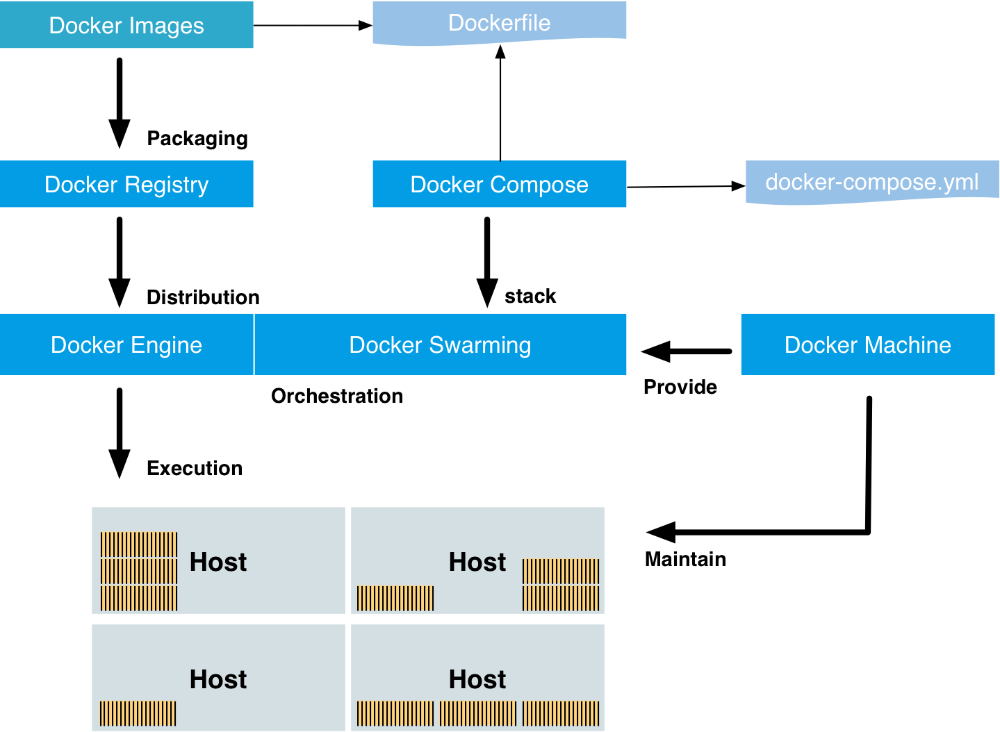

## New groove with docker and orchestration


**Walk-through Docker Orchestration**

### **Peter Rossbach**

-
## The crew bee42 invite you
## rethink IT with POTT

The Purpose, Organisation, Technology Transition concept


* Peter Rossbach - bee42 solutions gmbh
  * <peter.rossbach@bee42.com> @PRossbach

---
## Evolution or Revolution

***
From monolith to µService

---
### Drive your purpose with DevOps-Practices

<=>

## You Build    It
## You Ship     It
## You Run      It

<=>

## You Automate It
## You Test     It
## You Measure  It
## You Change   It

***
* Werner Vogels CTO Amazon 2006, __You build it, you run it__
* http://queue.acm.org/detail.cfm?id=1142065


---
## What is Docker?
### Docker-Mantra!

  - **B**uild, Ship and Run
  - **A**ny App,
  - **A**nywhere


-
## Docker virtualization


-
### Package your software with docker


-
### Docker Tools



-
### What Docker can do for you?

* Package your software
* Isolating your application dependencies
* Creating your application golden image and ship it
* Creating ready to start applications that are easily distributable
* Allowing easy and fast scaling of instances of you application
* Testing out applications and disposing them afterwards
* Roll forward you service faster

-
### Benefits of Docker

* Separation of concerns
* Developers focus on creating a system, instead only applications
* System administrators focus on deployment and delivery
* Better resource utilization
  * More apps on one host
* Faster development, testing, integration and delivery
* Portability
  * Build in one environment, distributed and run on many others
* Scalability
  * Easy to spin up new containers or migrate to more powerful features

-
### Microservices meets docker

  * Microservice means
    - developing a single,
    - small,
    - meaningful functional feature as single service.
  * Each service has its own process
    - and communicates with lightweight mechanism,
    - deployed in single or multiple servers.
  * Each service manages its own data exclusively.
***
[Microservice Architecture – A Quick Guide](http://www.javacodegeeks.com/2014/06/microservice-architecture-a-quick-guide.html)

-
### Microservice Benefits

* Split the monolith into smaller pieces
* Scale app horizontally and vertically
* Increase developer productivity
* Increase developer velocity
* Adpat newer technologies faster
* Swapout older technologies
* Faster delivery and value

-
### Scale Cube


***
[The Art of Scalability](http://microservices.io/articles/scalecube.html)

-
### The price of Scaling

* Redundancy
* Routing
* Error detection
* Failover
* Detect growing latencies
* Auto scaling up and down
* Control resource usage
* Control your dependencies
* Versioning
* Isolation
* Auto delivery

-
### Use resilience patterns
  * [Netflix OSS](http://netflix.github.io/)
  * [MICHAEL NYGARD - Release IT](http://www.michaelnygard.com/)
  * [Chaos Monkey](http://techblog.netflix.com/2011/07/netflix-simian-army.html)
***


-
### The Twelve Factors --I--

  * I. Codebase
   - One codebase tracked in revision control, many deploys
  * II. Dependencies
   - Explicitly declare and isolate dependencies
  * III. Config
   - Store config in the environment
  * IV. Backing Services
   - Treat backing services as attached resources
  * V. Build, release, run
    - Strictly separate build and run stages
  * VI. Processes
   - Execute the app as one or more stateless processes

-
### The Twelve Factors --II--

  * VII. Port binding
    - Export services via port binding
  * VIII. Concurrency
    - Scale out via the process model
  * IX. Disposability
    - Maximize robustness with fast startup and graceful shutdown
  * X. Dev/prod parity
    - Keep development, staging, and production as similar as possible
  * XI. Logs
    - Treat logs as event streams
  * XII. Admin processes
    - Run admin/management tasks as one-off processes
***
[The Twelve Factors](http://12factor.net/)

---
## Automate your system deliveries

* From source to production
* Build and use CI/CD Pipelines
* Use Jenkins, Gitlab/CI or CI cloud services
  * Docker Hub
  * Travis CI
  * Codeship
  * Circle Ci

---
## Lets dance with Orchestration


---
## Orchestration with Docker swarming


***
* Docker machines
* New docker engine (>1.12) based on docker swarmkit :-)
  * https://github.com/docker/swarmkit
  * https://speakerdeck.com/rossbachp/docker-swarmkit

-
### Docker machines


-
#### Simple Docker OS

* Core OS
* Rancher OS
* Boot2Docker
* Project Atomic
* VMware Photon OS™
* Moby OS (Docker for Mac - alpine)
* Hypriot OS (ARM, AARCH64)

-
### Overlay network


-
### Multi host networks


---
## Docker Orchestration with SwarmKit


-
### Docker swarming: Orchestration

* Desired State Reconciliation
* Service Types
  * Replicated Services
  * Global Services
* Configurable Updates
  * Parallelism
  * Delay
* Restart Policies
* Default Security

-
### Docker swarming: Scheduling


-
### Docker swarming: Scheduling details

* Resource Awareness
* Constraints
  * __IDs__
  * __names__
  * __labels__ (e.g. `node.labels.foo!=bar1`)
* Strategies
  * spread strategy
  * least loaded nodes
  * respect the constraints
  * respect the resource requirements

-
### Docker swarming: Cluster Management

* State Store
  * replicated (Raft based)
  * extremely fast (in-memory reads)
  * save snapshots
* Topology Management
  * managers
  * workers
* Node Management
  * pause/unpause
  * drain/activate
  * auto failure detection

-
### Docker swarming: Security

* Mutual TLS
  * create CA or use a user CA
  * manage certs to all nodes
* Acceptance Policy
  * auto accept
  * manually accept
  * require a secret to join the cluster
* Certificate Rotation
  * rotated and reloaded transparently on every node
  * default is 3 months, the minimum is 30 minutes

---
## By example:
## Start a docker swarming orchestration

* Create new machines with digitalocean|scaleway|xyhve
* Setup network (overlay)
* Manage a swarm on it :)
* use Docker > 1.13.x

-
### Docker machine provision


***
* https://github.com/zchee/docker-machine-driver-xhyve
* https://github.com/scaleway/docker-machine-driver-scaleway
* https://github.com/bee42/docker-machine-scaleway-creator

-
### Install Docker Machine

* https://docs.docker.com/machine/install-machine/

```
$ sudo -i
$ apt-get update && apt-get install -y curl
$ URL=https://github.com/docker/machine/releases/download/v0.10.0
$ curl -L $URL/docker-machine-`uname -s`-`uname -m` \
  > /usr/local/bin/docker-machine
$ chmod +x /usr/local/bin/docker-machine
$ URL_C=https://raw.githubusercontent.com/docker/machine/master/contrib
$ curl -L $URL_C/completion/bash/docker-machine.bash \
  > /etc/bash_completion.d/docker-machine.bash
$ exit
$ docker-machine --version
```

-
### Start your manage node

* Create your docker-machine
* Login to this machine
* Create a cluster manager and worker

-
### Create swarm-master machine : DigitalOcean

```
$ REGION=asm2
$ SIZE=1gb
$ DOT=<token>
$ docker-machine create \
    --driver digitalocean \
    --digitalocean-region $REGION \
    --digitalocean-size $SIZE\
    --digitalocean-access-token $DOT \
    --digitalocean-private-networking \
    --engine-label "cluster=moby2017" \
    --engine-label "role=master" \
    --engine-label "region=$REGION" \
    swarm-master
```

***
* Create a DigitalOcean account with this promo link
  * https://m.do.co/c/1b93d52f958f
* Test Release: `--engine-install-url "https://test.docker.com"`

-
### Setup swarm-master

```
$ docker $(docker-machine config swarm-master) swarm init \
 --advertise-addr $(docker-machine ip swarm-master):2377
$ SWARM_TOKEN=`docker $(docker-machine config swarm-master) \
 swarm join-token worker -q`
```

-
### Create second cluster node - worker

```
$ REGION=asm2
$ SIZE=1gb
$ MACHINE=swarm-01
$ DOT=
$ docker-machine create \
    --driver digitalocean \
    --digitalocean-region $REGION \
    --digitalocean-size $SIZE\
    --digitalocean-access-token $DOT \
    --digitalocean-private-networking \
    --engine-label "cluster=moby2016" \
    --engine-label "role=swarm" \
    --engine-label "region=$REGION" \
    $MACHINE
$ docker $(docker-machine config $MACHINE) swarm join \
 --token $SWARM_TOKEN \
 $(docker-machine ip swarm-master):2377
```

-
### Create swarm-master cluster at you mac with xhyve

```
$ brew install docker-machine docker docker-compose docker-machine-driver-xhyve
# docker-machine-driver-xhyve need root owner and uid
$ sudo chown root:wheel $(brew --prefix)/opt/docker-machine-driver-xhyve/bin/docker-machine-driver-xhyve
$ sudo chmod u+s $(brew --prefix)/opt/docker-machine-driver-xhyve/bin/docker-machine-driver-xhyve
$ URL=https://github.com/boot2docker/boot2docker/releases/download
$ for N in $(seq 1 3); do
  docker-machine create --driver xhyve
    --xhyve-memory-size 1024 \
    --xhyve-boot2docker-url "$URL/v17.03.0-ce/boot2docker.iso" \
    node$N
done
```

-
### Use docker machine creator


***
* https://github.com/bee42/docker-machine-scaleway-creator

-
#### Docker Machine Creator: Services


-
#### Make your machine available

```
$ CONTROL_API_VERSION="$(docker version --format '{{.Server.APIVersion}}')"
$ tar -C $DOCKER_CERT_PATH -cf- ca.pem cert.pem key.pem |
  docker run --name dockercontrol -i \
    -v /docker busybox \
  sh -c "tar -C /docker -xf-
    echo export DOCKER_API_VERSION=$CONTROL_API_VERSION
    echo export DOCKER_TLS_VERIFY=1 >>/docker/env
    echo export DOCKER_CERT_PATH=/docker >>/docker/env"
    echo export DOCKER_HOST=$DOCKER_HOST >>/docker/env
$ docker run --rm \
  --volumes-from dockercontrol docker \
  sh -c "source /docker/env; docker ps"
```

```
$ sudo curl -L https://raw.githubusercontent.com/jpetazzo/dctrl/master/dctrl \
  >/usr/local/bin/dctrl
$ sudo chmod +x /usr/local/bin/dctrl
```

***
* http://jpetazzo.github.io/2016/04/03/one-container-to-rule-them-all/
* https://github.com/jpetazzo/dctrl

---
## By Example:
## Docker Orchestration

* Use a whoami service
* Service Options
* Docker on ARM
  * uuid rolling update
* Visualizer of docker swarming
* Monitor docker and services with Prometheus
* ELK Stack
* Simple DIND Swarming
* Loadbalancing with Traefik
  * Docker Meetup Bochum 1.12:)

-
### Examples whoami

* https://github.com/emilevauge/whoamI

```
$ docker run -d -P --name iamfoo emilevauge/whoami
$ docker inspect --format '{{ .NetworkSettings.Ports }}' iamfoo
map[80/tcp:[{0.0.0.0 32769}]]
$ curl "http://0.0.0.0:32769"
Hostname :  6e0030e67d6a
IP :  127.0.0.1
IP :  ::1
IP :  172.17.0.27
IP :  fe80::42:acff:fe11:1b
GET / HTTP/1.1
Host: 0.0.0.0:32769
User-Agent: curl/7.35.0
Accept: */*
```

-
### Join the new node

```
$ MACHINE=xxx
$ SWARM_TOKEN=`docker $(docker-machine config swarm-master) \
 swarm join-token worker -q`
$ docker $(docker-machine config $MACHINE) swarm join \
 --token $SWARM_TOKEN \
 $(docker-machine ip swarm-master):2377
```

Second terminal

```
$ docker-machine ssh swarm-master
$ docker node ls
```

---
### Create a new service and scale

```
$ docker service create --name whoami emilevauge/whoami
$ docker service update --replicas 2  whoami
$ docker service inspect whoami
[
    {
        "ID": "ch1cizq1k61qigbswzdd0sryj",
        "Version": {
            "Index": 717
        },
        "CreatedAt": "2016-06-19T11:01:39.630354919Z",
        "UpdatedAt": "2016-06-19T11:02:20.137102719Z",
        "Spec": {
            "Name": "whoami",
...
]
$ docker service inspect whoami |jq "{ name: .[].Spec.Name , replicas: .[].Spec.Mode.Replicated.Replicas}"
{
  "name": "whoami",
  "replicas": 2
}
```

-
### Docker service options I

```
Usage:	docker service create [OPTIONS] IMAGE [COMMAND] [ARG...]

Create a new service

Options:
      --constraint list                  Placement constraints (default [])
      --container-label list             Container labels (default [])
      --dns list                         Set custom DNS servers (default [])
      --dns-option list                  Set DNS options (default [])
      --dns-search list                  Set custom DNS search domains (default [])
      --endpoint-mode string             Endpoint mode (vip or dnsrr)
  -e, --env list                         Set environment variables (default [])
      --env-file list                    Read in a file of environment variables (default [])
      --group list                       Set one or more supplementary user groups for the container (default [])
      --health-cmd string                Command to run to check health
      --health-interval duration         Time between running the check (ns|us|ms|s|m|h) (default none)
      --health-retries int               Consecutive failures needed to report unhealthy
      --health-timeout duration          Maximum time to allow one check to run (ns|us|ms|s|m|h) (default none)
      --help                             Print usage
      --host list                        Set one or more custom host-to-IP mappings (host:ip) (default [])
      --hostname string                  Container hostname
  -l, --label list                       Service labels (default [])
      --limit-cpu decimal                Limit CPUs (default 0.000)
      --limit-memory bytes               Limit Memory (default 0 B)
      --log-driver string                Logging driver for service
      --log-opt list                     Logging driver options (default [])
      --mode string                      Service mode (replicated or global) (default "replicated")
      --mount mount                      Attach a filesystem mount to the service
...
```

-
### Docker service options II

```
...
      --name string                      Service name
      --network list                     Network attachments (default [])
      --no-healthcheck                   Disable any container-specified HEALTHCHECK
      --port port                        Publish a port
      --replicas uint                    Number of tasks (default none)
      --reserve-cpu decimal              Reserve CPUs (default 0.000)
      --reserve-memory bytes             Reserve Memory (default 0 B)
      --restart-condition string         Restart when condition is met (none, on-failure, or any)
      --restart-delay duration           Delay between restart attempts (ns|us|ms|s|m|h) (default none)
      --restart-max-attempts uint        Maximum number of restarts before giving up (default none)
      --restart-window duration          Window used to evaluate the restart policy (ns|us|ms|s|m|h) (default none)
      --secret secret                    Specify secrets to expose to the service
      --stop-grace-period duration       Time to wait before force killing a container (ns|us|ms|s|m|h) (default none)
  -t, --tty                              Allocate a pseudo-TTY
      --update-delay duration            Delay between updates (ns|us|ms|s|m|h) (default 0s)
      --update-failure-action string     Action on update failure (pause|continue) (default "pause")
      --update-max-failure-ratio float   Failure rate to tolerate during an update
      --update-monitor duration          Duration after each task update to monitor for failure (ns|us|ms|s|m|h) (default 0s)
      --update-parallelism uint          Maximum number of tasks updated simultaneously (0 to update all at once) (default 1)
  -u, --user string                      Username or UID (format: <name|uid>[:<group|gid>])
      --with-registry-auth               Send registry authentication details to swarm agents
  -w, --workdir string                   Working directory inside the container
```

---
### Add a service to all nodes

```
$ eval $(docker-machine env swarm_master)
$ docker service create --name cadvisor --mode global \
 --mount type=bind,source=/,target=/rootfs/,writable=false \
 --mount type=bind,source=/var/run/,target=/var/run/ \
 --mount type=bind,source=/sys/,target=/sys/,writable=false \
 --mount type=bind,source=/var/lib/docker/,target=/var/lib/docker/,writable=false \
  --publish 8080:8080 \
  google/cadvisor:latest
```

***
* Add a new node, and service is started...

-
### Add node labels

```
$ docker node update --label-add foo worker1
$ docker node update --label-add foo --label-add bar worker1
```

```
Usage:  docker node update [OPTIONS] NODE

Update a node

Options:
      --availability string   Availability of the node (active/pause/drain)
      --help                  Print usage
      --label-add value       Add or update a node label (key=value) (default [])
      --label-rm value        Remove a node label if exists (default [])
      --role string           Role of the node (worker/manager)
```

---
### Specify service constraints (–constraint)

| node attribute  | matches                  | example                                         |
|:----------------|:-------------------------|:------------------------------------------------|
| `node.id`       | node ID                  | `node.id == 2ivku8v2gvtg4`                      |
| `node.hostname` | node hostname            | `node.hostname != node-2`                       |
| `node.role`     | node role: manager       | `node.role == manager`                          |
| `node.labels`   | user defined node labels | `node.labels.security == high`                  |
| `engine.labels` | Docker Engine’s labels   | `engine.labels.operatingsystem == ubuntu 14.04` |

```
$ docker service create \
  --name redis_2 \
  --constraint 'node.labels.type == queue' \
  redis:3.0.6
```
-
#### Service update from constraints and labels

```
$ docker service update \
  --constraint-add 'node.labels.storage == ssd' \
   redis_2
```

| option                        | description                                        |
|:------------------------------|:---------------------------------------------------|
| `--constraint-add value`      | Add or update placement constraints | (default []) |
| `--constraint-rm value`       | Remove a constraint (default [])                   |
| `--container-label-add value` | Add or update container labels (default [])        |
| `--container-label-rm value`  | Remove a container label by its key (default [])   |

-
#### Add label to a docker service

```
$ docker service create \
  --name redis_2 \
  --label com.example.foo="bar"
  --label bar=baz \
  redis:3.0.6
```

-
#### Docker service filtering

* id
* label
* name

```
$ docker service ls -f "id=0bcjw"
$ docker service ls --filter label=project
$ docker service ls --filter label=project=project-a
$ docker service ls --filter name=redis
```

-
#### Docker Service Volumes

* Mount Named Volume
* Mount Anonymous Volume
* Bind Mount Volume

-
##### Mount Named Volume

```
$ docker service create \
  --name my-service \
  --replicas 3 \
  --mount type=volume,source=my-volume,destination=/path/in/container,volume-label="color=red",volume-label="shape=round" \
  nginx:alpine
```

-
##### Mount Anonymous Volume

```
$ docker service create \
  --name my-service \
  --replicas 3 \
  --mount type=volume,destination=/path/in/container \
  nginx:alpine
```

-
##### Bind Mount Volume

```
$ docker service create \
  --name my-service \
  --mount type=bind,source=/path/on/host,destination=/path/in/container \
  nginx:alpine
```

---
### RPI Docker Swarming Lab


***
* https://github.com/bee42/docker-on-rpi-lab

-
### Rolling service update on a PI-Cluster

UUID swarming

```
# login to swarm manager
$ docker build --build-arg UUID_VERSION=0.0.1 \
  -t bee42/rpi-uuid:0.0.1 -f Dockerfile.uuid .
$ docker tag bee42/rpi-uuid:0.0.1 queenshive:5000/bee42/rpi-uuid:0.0.1
$ docker push queenshive:5000/bee42/rpi-uuid:0.0.1
$ docker service create --name uuid queenshive:5000/bee42/rpi-uuid:0.0.1
$ docker service update --publish-add 9080:8080 uuid
$ docker service update --replicas 2 uuid
```

UUID next version

```
$ docker build --build-arg UUID_VERSION=0.0.2 \
  -t bee42/rpi-uuid:0.0.2 -f Dockerfile.uuid .
$ docker tag bee42/rpi-uuid:0.0.2 queenshive:5000/bee42/rpi-uuid:0.0.2
$ docker push queenshive:5000/bee42/rpi-uuid:0.0.2
$ docker service update \
 --replicas 4 \
 --update-delay 10s \
 --image queenshive:5000/bee42/rpi-uuid:0.0.2 uuid
```

-
### Access uuid service

```
$ curl 192.168.5.1:9080/uuid/index.jsp
{
  "Container": "9e1daabe3fb2",
  "UUID": "37a971b7-1467-47de-90e2-20cd2d9de4df",
  "Date": "2016/10/25 14:30:25",
  "Timestamp": "1477405825",
  "Version": "0.0.2"
}
```
---
### Visualizer of docker swarming

```
$ docker run -it -d -p 5000:5000 \
  -e HOST=192.168.5.1 \
  -e PORT=5000 \
  -v /var/run/docker.sock:/var/run/docker.sock \
  queenshive:5000/bee42/swarm-visualizer
```

***
*  https://github.com/ManoMarks/docker-swarm-visualizer

-
### docker visualizer screenshot 1


-
### docker visualizer screenshot 2


---
### Metrics: Start node exporter and cadvisor

```
$ docker service create --name node --mode global --network prom \
 --mount type=bind,source=/proc,target=/host/proc \
 --mount type=bind,source=/sys,target=/host/sys \
 --mount type=bind,source=/,target=/rootfs \
 prom/node-exporter \
  -collector.procfs /host/proc \
  -collector.sysfs /host/proc \
  -collector.filesystem.ignored-mount-points "^/(sys|proc|dev|host|etc)($|/)"
$ docker service create --name cadvisor --network prom --mode global \
  --mount type=bind,source=/,target=/rootfs \
  --mount type=bind,source=/var/run,target=/var/run \
  --mount type=bind,source=/sys,target=/sys \
  --mount type=bind,source=/var/lib/docker,target=/var/lib/docker \
  google/cadvisor:latest
```

-
#### Start prometheus and grafana

```
$ cat >prometheus.conf <<EOFglobal:
scrape_interval: 1s
scrape_configs:
  - job_name: 'prometheus'
    static_configs:
      - targets: ['localhost:9090']
  - job_name: 'node'
    dns_sd_configs:
      - names: ['tasks.node']
        type: 'A'
        port: 9100
  - job_name: 'cadvisor'
    dns_sd_configs:
      - names: ['tasks.cadvisor']
        type: 'A'
        port: 8080  
EOF
$ cat >Dockerfile <<EOF
FROM prom/prometheus
COPY prometheus.yml /etc/prometheus/prometheus.yml
EOF
$ docker build -t localhost:5000/prometheus .
$ docker push localhost:5000/prometheus
$ docker service create --network prom --name prom \
       --publish 9090:9090 localhost:5000/prometheus
```

---
### ELK Stack with docker swarming

```
$ docker network create --driver overlay logging
$ docker service create --network logging \
  --name elasticsearch elasticsearch:2.4
$ docker service create --network logging \
  --name kibana --publish 5601:5601 \
  -e ELASTICSEARCH_URL=http://elasticsearch:9200 kibana:4.6
```

-
#### Logstash: config

```
$ cat >logstash.conf <<EOF
input {
  # Listens on 514/udp and 514/tcp by default; change that to non-privileged port
  syslog { port => 51415 }
  # Default port is 12201/udp
  gelf { }
  heartbeat { }
}
filter {
  ruby {
    code => "
      event.to_hash.keys.each { |k| event[ k.gsub('.','_') ] = event.remove(k) if k.include?'.' }
    "
  }
}
output {
  elasticsearch {
    hosts => ["elasticsearch:9200"]
  }
  stdout {
    codec => rubydebug
  }
}
EOF
```

-
#### Logstash: start and usage

```
$ docker service create --network logging \
  --name logstash -p 12201:12201/udp \
  logstash:2.4 -e "$(cat ./logstash.conf)"
$ docker service ps logstash
$ CID=$(docker ps -q --filter label=com.docker.swarm.service.name=logstash)
$ docker logs --follow $CID
$ docker run --log-driver gelf \
  --log-opt gelf-address=udp://127.0.0.1:12201 \
  --rm alpine echo hello
$ open http://$(docker-machine ip worker1):5601/
$ for SERVICE in app1 app2 ; do
    docker service update $SERVICE \
      --log-driver gelf --log-opt gelf-address=udp://127.0.0.1:12201
done
```

---
### More to Test

* Auto update to next software release
  * A/B Testing
  * Canary Deployment
* Multi-Network Handling
* Control the liveness with Healthcheck
* Swarming with prometheus - no scraper at this moment!
* Create a Visualizer for complex setups
* Volume Management and Docker Plugin's
* Check the API
* DAB Format and docker-compose

-
### More Docker Swarming possible


---
## Docker-in-Docker with swarming mode at Docker For Mac

```
$ docker swarm init
$ SWARM_TOKEN=$(docker swarm join-token -q worker)
$ SWARM_MASTER=$(docker info | grep -w 'Node Address' | awk '{print $3}')
$ NUM_WORKERS=3
$ for WORKER_NUMBER in $(seq ${NUM_WORKERS}); do
    docker run -d --privileged --name worker-${WORKER_NUMBER} \
      --hostname=worker-${WORKER_NUMBER} \
      -p ${WORKER_NUMBER}2375:2375 docker:1.13.0-rc2-dind
    docker --host=localhost:${WORKER_NUMBER}2375 swarm join \
      --token ${SWARM_TOKEN} \
      ${SWARM_MASTER}:2377
done
$ docker run -it -d -p 5080:8080 --name visualizer  \
  -v /var/run/docker.sock:/var/run/docker.sock \
  manomarks/visualizer

```

***
* https://medium.com/@alexeiled/docker-swarm-cluster-with-docker-in-docker-on-macos-bdbb97d6bb07#.yry5s0jiv
* http://blog.terranillius.com/post/swarm_dind/
* https://github.com/ManoMarks/docker-swarm-visualizer

---
## Add a easy loadbalancer like Træfɪk


***
* https://traefik.io/
* https://github.com/bee42/traefik-with-docker

-
### Have fun with Træfɪk community


-
### Simple Træfɪk one host example

```
traefik:
  image: traefik
  command: --web --docker --docker.domain=docker.localhost --logLevel=DEBUG
  ports:
    - "80:80"
    - "8080:8080"
  volumes:
    - /var/run/docker.sock:/var/run/docker.sock
    - /dev/null:/traefik.toml

whoami:
  image: emilevauge/whoami
  labels:
    - "traefik.backend=whoami"
    - "traefik.frontend.rule=Host:whoami.docker.localhost"
```

-
### Træfɪk at docker swarming mode


```
$ docker-machine ssh swarm-master \
  "docker network create --driver=overlay traefik-net"
$ docker-machine ssh swarm-master "docker service create \
  --name traefik \
  --constraint=node.role==manager \
  --publish 80:80 \
  --publish 8080:8080 \
  --mount type=bind,source=/var/run/docker.sock,target=/var/run/docker.sock \
  --network traefik-net \
  traefik:v1.2.0-rc2 \
  --docker \
  --docker.swarmmode \
  --docker.exposedbydefault=false \
  --docker.domain=traefik \
  --docker.watch \
  --web"
```

***
* https://github.com/containous/traefik/blob/master/docs/user-guide/swarm-mode.md

-
#### Deploy a new swarm services

```
$ docker-machine ssh swarm-master "docker service create \
    --name whoami0 \
    --label traefik.port=80 \
    --label traefik.enable=true \
    --label traefik.backend.loadbalancer=drr \
    --network traefik-net \
    emilevauge/whoami"
$ docker-machine ssh swarm-master "docker service create \
    --name whoami1 \
    --label traefik.port=80 \
    --label traefik.enable=true \
    --label traefik.backend.loadbalancer=drr \
    --network traefik-net \
    emilevauge/whoami"
```

```
$ curl -H Host:whoami0.traefik http://$(docker-machine ip manager)
$ docker-machine ssh swarm-master "docker service update replicas=6 whoami0"
$ watch curl -H Host:whoami0.traefik http://$(docker-machine ip manager)
```

-
### Træfɪk Dashboard


-
### User with cluster

* Use old docker swarm
* Use consul, etcd with registrator
* New docker swarm 1.12 is available >1.1.0!
* https://hub.docker.com/r/library/traefik/

---
## Other popular orchestration systems

* Kubernetes
  * Google App Engine
  * Open Shift
  * Deis
* Mesos (DC/OS)
* AWS ECS
* Rancher OS

---
## Infrakit


-
### Infrakit short description

* declarative management toolkit for orchestrating infrastructure
* describe infrastructur encapsulation and composition
* active control
  * monitor infrastucture status
  * detect state divergence
  * take action
* continuous monitoring and reconciliation
* rolling update

***
* https://github.com/docker/infrakit
* http://de.slideshare.net/chanezon/whats-new-in-docker-infrakit-docker-meetup-berlin-2016

-
### Infrakit Architecture


---
## My golden container build rules

| rule             | description                                                                   |
|:-----------------|:------------------------------------------------------------------------------|
| ONE PURPOSE      | The container has only one purpose                                            |
| LABELING         | Add many metadata to your container                                           |
| WORKING          | The container is up and running                                               |
| FIX DEPENDENCIES | The container has controlled dependencies                                     |
| MINIMAL          | The container has only minimal content, nothing more                          |
| WHITEBOX         | The container source must be available                                        |
| SECURE           | The container must be periodically updated                                    |
| LIMITED          | The container can only consume limited resources                              |
| TRUST            | The creator of the containers is trustworthy and the content can be validated |


---
## Status:
## Docker Swarming

* Nice concept and easy to use
* Simple and powerful orchestration solution
* Play around with fun
* ToDo:
  * Better support of storage handling
  * Serverless and Job scheduling support
  * More options to service create (security and resource handling)
  * Integration of Infrakit
* Check your networking skills!

---
## Summary
-
### Containerize your software to create faster value
-
### Deploy and run software with Docker swarming is now much easier
-
### Learn more to use a dynamic infrastructure
-
### Please, use cloud technologies and services at your daily business
-
### DevOps changes your organizational structure, to it first.
-
### You need more hardcore IT-knowledge at your teams
-
### Start an aggressive learning culture at your team
-
### Docker Ecosystem and the IT market growing and moving fast forward

### Docker and Kubernetes Ecosystem
### growing
### and
### moving
### fast forward
-
### Don't forget

* reduce you coupling
* add metrics
* design for failure
* setup machines and network automatically
* handling your persistence states on classic infrastructure
* your developer need a prod like environment
* safe your persistence data
-
### The system is the asset
-
### Build your system for friends


---
## Many Thanks for following!

* Start this presentation with
  * `docker run -d -ti -p 4221:80 bee42/docker-orchestration-swarming`
  * `open http://<dockerhost>:4221/docker-orchestration-swarming`

***
Peter Rossbach

follow the us at [bee42.com](https://bee42.com)

@PRossbach

More Training: https://bee42.com/#scroll-top-trainings

-
### Docker DevOps Camp


* 16.3 Docker Meetup Bochum - Docker Birthday Party Zalando
* 23-25.3 DevOpsGathering Konferenz - Bochum

***
* https://bee42.com
* https://devops-gathering.io

-
### bee42 solutions gmbh - Devops Bochum
### rethink IT at the POTT


We offer TOP-IT jobs...

***
* https://bee42.com

-
#### DevOps Engineer

* Living an Agile culture
* Influence us to DevOps-Journey
* Enable people to use modern technologies
* Build applications that living at the clouds
* Design services with clever API's
* Think infrastructure first

***
* send your offering to peter.rossbach@bee42.com

-
#### Website Engineer

* Create beautiful human responsive services
* Find new ways to create creative web service
* Find good solutions with HTML/CSS/Javascript to create simple services
* Think mobile first

***
* send your offering to peter.rossbach@bee42.com

-
### Setlog GmbH - Supply Chain Management


We offer jobs...

* Administrator
  * Experiences with
    * Maintain a cluster of linux machines
    * Setup Docker infrastructure
    * Config management with ansible
    * Release java applications
  * Linux and mysql skills
* Developer
  * Experiences with
    * Create java based *micro*services
    * Spring Boot and Netflix Stack
    * Docker knowledge

***
* send your offering to p.rossbach@setlog.com

-
### German Docker Book


***
* http://www.dpunkt.de/docker

-
### Give the navigator the rudder!


---
## Appendix

This slides shows shell commands executed in different places. The line prefix shows where to run them:

```
$ ... – local machine
> ... – remote machine
# ... – docker container
```

---
## Links

* https://bee42.com
* https://devops-gathering.io
* http://www.infrabricks.de
* https://github.com/bee42/traefik-with-docker
* https://github.com/bee42/docker-on-rpi-lab
* https://www.docker.com
* https://github.com/docker/docker
* https://github.com/docker/machine
* https://github.com/docker/swarm
* https://github.com/docker/compose
* https://github.com/docker/swarmkit
* https://github.com/docker/infrakit
